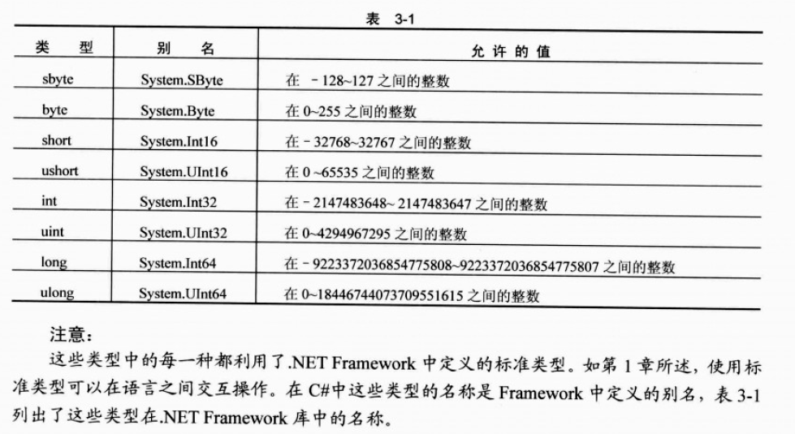

# BeginCSharp-语法

## 注释
和C++一样的注释

    // 注释
    /* 
    ** 注释
    */

和OC的`#pragma mark` 类似的作用

    #region
    
    #endregion
    
## 变量

变量的声明：

    <type> <name>;
    
需要注意的部分，声明不等于定义，这点是和C++不同的地方。定义需要调用

    <type> <name> = new <type>();
    
基础类型除外。

